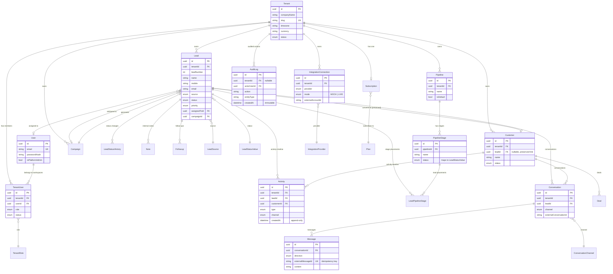

# Database ER Diagram

Full schema: [`prisma/schema.prisma`](../prisma/schema.prisma) (40+ models). This diagram covers
the core relationships; billing (`Plan`/`Subscription`/`Invoice`/`Payment`), automation
(`AutomationRule`/`AutomationRun`), and AI (`AiRequestLog`) tables are omitted for readability but
follow the same `tenantId`-scoped pattern.

## Notes on the model

- **`Lead.leadNumber`** is a per-tenant sequence (via the `LeadCounter` row) that gives you the
  human-readable `LEAD-000123` id, distinct from the internal UUID `id`.
- **Converting a lead never deletes it.** `Customer.leadId` links back to the originating lead;
  the lead's status moves to `CUSTOMER` but its full history, activities, notes, and conversations
  stay attached and queryable.
- **`LeadStatusHistory` and `Activity` are append-only** by convention (enforced in application
  code, not a DB trigger) — status changes and timeline entries are never overwritten or deleted
  by normal application flows.
- **`Message.externalMessageId`** carries a unique constraint per tenant, which is what makes
  webhook redelivery idempotent at the data layer, on top of the `WebhookEvent` ledger.
